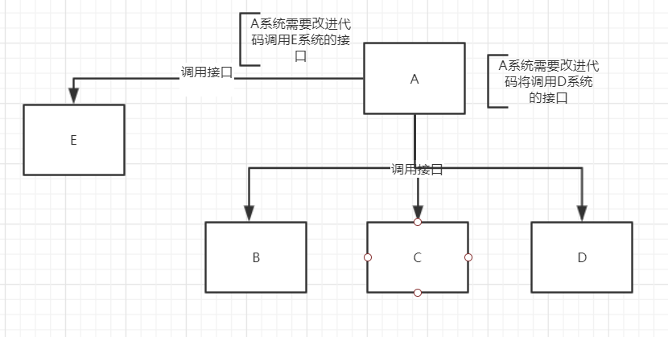

##. 消息中间件
+ 为什么使用消息队列？
+ 消息队列有什么优点和缺点？
+ kafka、ActiveMQ、RabbitMQ、RocketMQ都有什么区别，以及适用哪些场景？

面试官心理分析：
其实面试官主要是想看看：
+ **第一**，你知不知道你们系统里为什么要使用消息队列这个东西?
  不少候选人，说自己项目里用了Redis、MQ，但是其实他并不知道自己为什么要用这个东西。其实说白了，就是为了用而用，或者是别人设计的架构，从来没有考虑过为什么要使用。没有对自己的架构问过为什么的人，一定是平时没有爱考的人。面试官对这类候选人印象通常都不是特别好。因为面试官担心你进了团队之后只会木头木脑的干呆活儿，不会自己思考。
  
+ **第二**,你既然用了消息队列这个东西，你知不知道用了有什么好处和坏处？
  你要是没考虑过这个，那作为项目组的成员，你盲目弄个MQ进系统里，后面出了问题你是不是就自己溜了给公司留坑？你要是没考虑过引入一个新技术可能带来的弊端和风险。面试官把这类候选人招进来了，基本可能就是挖坑。就怕你干1年挖一堆坑，自己跳槽了，给公司留下无穷后患。作为后端，是一个公司产品的根基，对任何技术的选型都要有成熟的评估和方案来做支撑。

+ **第三**，既然你用了MQ，可能是某一种MQ，那么你当时做没做过调研？
  你千万别一拍脑袋看个人喜好就瞎用了一个MQ,比如Kafka，甚至都从没调研过业界流行的MQ到底有哪几种。每一种MQ的优点和缺点是什么。每一个MQ没有绝对的好坏，但是就是看用在那个场景可以扬长避短，利用优势，规避其劣势。 如果把一个不考虑技术选型的候选人招进了团队，leader交给他一个任务，去设计个什么系统，他在里面用一些技术，可能都没考虑过选型，最后选的级数可能并不一定合适，一样是留坑。
 
#### 面试题剖析

##### 为什么使用消息队列

其实就是问问你消息队列都有哪些使用场景，然后你项目里具体是什么场景，说说你在这个场景里用消息队列是什么？

面试官问你这个问题，**期望的一个回答**是说，你们公司有个什么**业务场景**，这个业务场景有个什么技术挑战，如果不用MQ可能会很麻烦，但是你现在用了MQ带给你哪些方面的好处。

先说一下消息队列常见的使用场景吧，其实场景是有很多，但是比较核心的有3个：解耦、异步、削峰。

**解耦**

看这么一个场景，A系统发送数据到BCD三个系统，通过接口调用发送，如果E系统也需要这个数据呢？那如果C系统现在不需要了呢？A系统负责人几乎崩溃......

在这个场景中，A系统跟其他各种乱七八糟的系统严重耦合，A系统产生一天比较关键的数据，很多系统都需要A系统将这个数据发送过来。A系统要时刻考虑BCDE四个系统如果挂了该咋办？要不要重发，要不要把消息存起来，太麻烦了啊！

如果使用MQ，A系统产生一条数据，发送到MQ里面去，那个系统需要就自己去MQ里面消费。如果新系统需要数据，直接从MQ里消费即可；如果某个系统不需要这条数据了，就取消对MQ消息的消费即可。这样下来，A系统压根不需要去考虑要给谁发送数据，不需要维护这部分代码，也不需要考虑人家是否调用成功、失败超时等情况。

发布订阅的设计模式：

[MQ参考](https://github.com/doocs/advanced-java/blob/master/docs/high-concurrency/why-mq.md)

## SaaS

